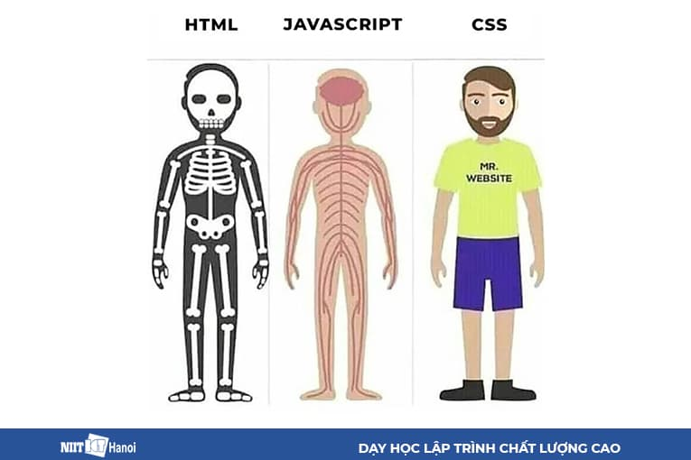
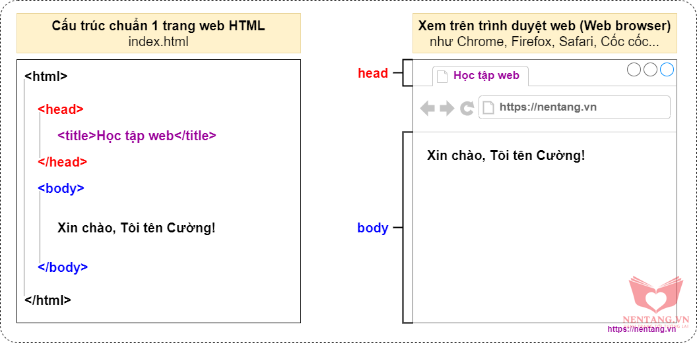
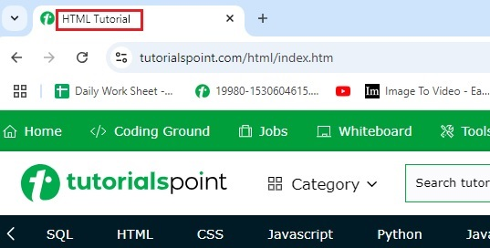
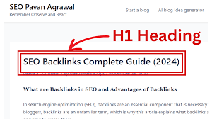
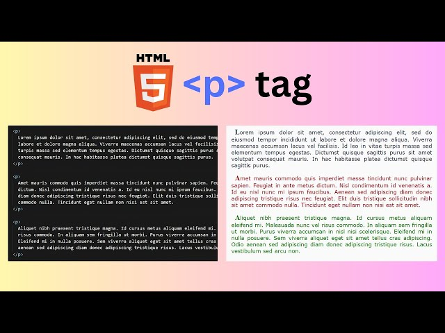
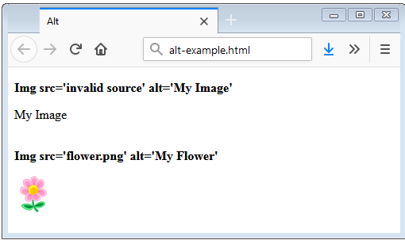

## Bài 1 - HTML

- HTML là viết tắt của cụm từ **HyperText Markup Language**, là ngôn ngữ đánh dấu siêu văn bản.
- CSS là viết tắt của cụm từ **Cascading Style Sheets**, là ngôn ngữ định dạng.

Ví dụ: Bạn có thể tưởng tượng HTML như cấu trúc xương của một con người, còn CSS là màu da và quần áo của con người bên ngoài.
<br>

- HTML được sử dụng để tạo ra cấu trúc của một trang web, còn CSS được sử dụng để tạo ra giao diện của trang web.

### Những lưu ý trước khi học:

- HTML sử dụng các thẻ để đánh dấu nội dung của trang web.
- Một thẻ HTML bắt đầu bằng dấu `<` và kết thúc bằng dấu `>`. Thẻ kết thúc có dấu `/` trước tên thẻ. Cấu trúc: `<tên_thẻ> nội dung </tên_thẻ>`. 
    - VD: `<p>Đây là một đoạn văn</p>`, `<h1>Đây là tiêu đề</h1>`, `<a href="https://www.google.com">Đây là link</a>`.
- Một số thẻ HTML không cần thẻ kết thúc, gọi là thẻ rỗng. 
    - VD: ``, `<br>`, `<hr>`.
- Trong thẻ HTML có thể chứa các thuộc tính, các thuộc tính này sẽ được viết sau tên thẻ và giá trị của thuộc tính được viết trong dấu `""`. Cấu trúc: `<tên_thẻ thuộc_tính="giá_trị">`. 
    - VD: `<a href="https://www.google.com">Đây là link</a>`, ``. Ở đây `href` và `src` là tên thuộc tính, `https://www.google.com` và `image.png` là giá trị của thuộc tính.

### Cấu trúc cơ bản của một file HTML:
- Một file HTML bắt đầu bằng thẻ `<!DOCTYPE html>`, đây là thẻ khai báo phiên bản HTML mà trang web sử dụng. Chủ yếu để trình duyệt hiểu được cấu trúc của trang web.
- Thẻ `<html>` bao quanh toàn bộ nội dung của trang web. Bên trong thẻ này sẽ chứa 2 thẻ con là `<head>` và `<body>`.
    - Thẻ `<head>` chứa các thông tin mô tả về trang web, các thẻ `<meta>`, `<title>`, `<link>`, `<style>`, `<script>`.
    - Thẻ `<body>` chứa nội dung hiển thị trên trang web.
<br>
- Cấu trúc cơ bản của một file HTML:
<br>
    ```html
    <!DOCTYPE html>
    <html>
    <head>
        <title>Trang web của tôi</title>
    </head>
    <body>
        <h1>Đây là tiêu đề</h1>
        <p>Đây là một đoạn văn</p>
    </body>
    </html>
    ```
    - Trong đó: 
        - `<title>`: Tiêu đề của trang web, hiển thị ở phần tab của trình duyệt.
        <br>
        - `<h1>` -> `<h6>`: Tiêu đề của nội dung trang.
        <br>
            - Trong đó: 
                - `<h1>`: Tiêu đề lớn nhất. Chỉ nên sử dụng một thẻ `<h1>` trong một trang web.
                - `<h?>`: Tiêu đề từ lớn đến nhỏ dần, với `?` là số từ 1 đến 6.
                - `<h6>`: Tiêu đề nhỏ nhất.
                <br>
        - `<p>`: Đoạn văn.
        <br>
### Đường dẫn tương đối và đuờng dẫn tuyệt đối:
- Đường dẫn tuyệt đối là đường dẫn đầy đủ từ file hiện tại đến file cần truy cập. 
    - VD: `C:\Users\PC\Desktop\file.html`, `https://www.google.com/file.html`.
- Đường dẫn tương đối là đường dẫn tính từ file hiện tại đến file cần truy cập.
    - VD: Ta có cấu trúc như sau:
    ```
        /project
        ├── /Website1
        │   ├── SanPham.html
        │   └── MuaHang.html
        ├── /Website2
        │   ├── GiaCa.html
        │   └── ViTri.html
        ├── /Website3
        │   ├── TaiLieu.html
        │   └── TaiNguyen.html
        ├── /Website4
        │   ├── GioHang.html
        │   └── LienHe.html
        └── index.html
    ```
    - Trong thư mục Website1, giả sử chúng ta đang ở file `SanPham.html` và chúng ta muốn truy cập đến file `MuaHang.html`.
        - Do trong cùng một thư mục nên ta có thể sử dụng đường dẫn tương đối để trỏ đến file đó như sau: 
            - `MuaHang.html` hoặc `./MuaHang.html`.
        - Nếu ở đây chúng ta sử dụng đường dẫn tuyệt đối thì sẽ rất dài dòng như thế này:
            - `/project/Website1/MuaHang.html`.
    - Thế giả sử ta lại không muốn trỏ đến file `MuaHang.html` mà muốn trỏ đến file `index.html` trong thư mục `project` ngoài cùng thì làm sao?
        - Để làm được điều đấy ta phải thoát ra khỏi thư mục hiện tại, sau đó mới trỏ đến file cần truy cập.
        - Ta có cú pháp như sau: `../index.html`.
            - Trong đó `../` dùng để thoát ra khỏi thư mục hiện tại.
    - Thế lại giả sử ta lại không muốn trỏ đến file `index.html` mà muốn trỏ đến file `TaiLieu.html` trong thư mục `Website3` thì làm sao?
        - Ta cũng sẽ sử dụng cú pháp như thế: `../Website3/TaiLieu.html`.
        - Nhưng khác một điều là thay trỏ đến file `index.html` mà ta truy cập vào thư mục `Website3` nơi chứa file `TaiLieu.html`.

### Thẻ HTML Link và Image:
- Thẻ `<a>`: Dùng để tạo ra một liên kết đến một trang web khác hoặc một tài nguyên khác.
    - Cú pháp: `<a href="đường_dẫn">nội_dung</a>`.
    - VD: `<a href="https://www.google.com">Đây là link</a>`.
    - Ngoài thuộc tính `herf` ta còn các thuộc tính khác như `target`, `download`, `hreflang`, `title`.
        - `target`: Dùng để mở liên kết trong một cửa sổ(tab) mới hoặc cùng cửa sổ(tab) hiện tại.
            - `target="_blank"`: Mở liên kết trong một cửa sổ(tab) mới.
            - `target="_self"`: Mở liên kết trong cùng một cửa sổ(tab)(Giá trị mặc định).
        - `download`: Dùng để tải về tài nguyên khi click vào liên kết.
            - `download="tên_file"`: Tên file mà bạn muốn lưu về máy. **Nếu không chỉ định tên file thì tên mặc định của file sẽ được sử dụng làm tên file khi tải về**
        - `hreflang`: Dùng để xác định ngôn ngữ của trang web hoặc tài nguyên được liên kết.
            - `hreflang="mã_ngôn_ngữ"`: Mã ngôn ngữ của trang web hoặc tài nguyên được liên kết. **Cấu trúc của Mã ngôn ngữ: ngôn_ngữ-quốc_gia**. VD: `en-US`(Mỹ), `vi-VN`(Việt Nam), `zh-CN`(Trung Quốc), `ko-KR`(Hàn Quốc), ...
        - `title`: Dùng để hiển thị một chú thích khi di chuột vào liên kết.
        - `href`: Dùng để xác định đường dẫn đến trang web hoặc tài nguyên khác. Có thể là **đường dẫn tương đối hoặc đường dẫn tuyệt đối**.
        - Thuộc tính `href` không chỉ sử dụng để điều hướng đến một trang web mà còn có thể sử dụng để điều hướng đến **một phần tử trong cùng một trang web, gửi email, gọi số điện thoại, gửi tin nhắn SMS,...**
            ```html
            <a href="#id">Điều hướng đến phần tử có id là id</a>

            <a href="mailto:nguyenvana@gmail.com">Gửi email</a>

            <a href="tel:0123456789">Gọi số điện thoại</a>

            <a href="sms:0123456789">Gửi tin nhắn SMS</a>
            ```
            - Trong đó ta thêm tiền tố `mailto:`(Đối với gửi email), `tel:`(Đối với gọi số điện thoại), `sms:`(Đối với gửi tin nhắn) để xác định mục đích sử dụng của `href`.
    - VD: 
    ```html
    <a href="https://www.google.com">Đây là link</a>

    <a href="https://www.google.com" target="_blank">Đây là link mở trong tab mới</a>

    <a href="https://www.google.com" download="google">Đây là link tải về</a>

    <a href="https://www.google.com" hreflang="en-US">Đây là link điều hướng đến trang web có ngôn ngữ tiếng Anh</a>

    <a href="https://www.google.com" title="Google">Đây là link khi di chuột vào sẽ hiện một chú thích nhỏ Google</a>
    ```
- Thẻ ``: Dùng để hiển thị một hình ảnh trên trang web.
    - Cú pháp: ``.
    - VD: ``.
    - Ngoài thuộc tính `src` và `alt` ta còn các thuộc tính khác như `width`, `height`, `loading`, `fetchpriority`.
        - `width`: Chiều rộng của hình ảnh.
            - `width="số_pixel"`: Số pixel chiều rộng của hình ảnh.
        - `height`: Chiều cao của hình ảnh.
            - `height="số_pixel"`: Số pixel chiều cao của hình ảnh.
        - `src`: Đường dẫn đến hình ảnh. Có thể là **đường dẫn tương đối hoặc đường dẫn tuyệt đối**.
        - `alt`: Mô tả hình ảnh. **Thuộc tính này rất quan trọng vì nó sẽ được hiển thị khi hình ảnh không thể hiển thị trong một số trường hợp(như ảnh sai đường dẫn, file ảnh không được hỗ trợ).**
            - `alt="mô_tả"`: Mô tả của hình ảnh.
            <br>
        - `loading`: Dùng để xác định thuật toán tải hình ảnh cho trình duyệt.
            - `loading="lazy"`: Hình ảnh sẽ được tải ngay khi nó nằm trong vùng nhìn thấy của thiết bị người dùng(như **điện thoại, máy tính**).
            - `loading="eager"`: Hình ảnh sẽ được tải ngay lập tức(Giá trị mặc định). **Không khuyến khích sử dụng giá trị này!**.
        - `fetchpriority`: Dùng để xác định mức độ ưu tiên của việc tải hình ảnh này so với các hình ảnh khác.
            - `fetchpriority="auto"`: Trình duyệt sẽ tự động xác định mức độ ưu tiên(Giá trị mặc định).
            - `fetchpriority="high"`: Mức độ ưu tiên tải hình ảnh này cao hơn so với các hình ảnh khác.
            - `fetchpriority="low"`: Mức độ ưu tiên tải hình ảnh này thấp hơn so với các hình ảnh khác.
    - VD:
    ```html
    

    

    

    
    ```

### Thẻ HTML định dạng văn bản: 
- Thẻ `<b>`: Dùng để in đậm văn bản.
    - VD: `<b>Đây là văn bản in đậm</b>` -> **Đây là văn bản in đậm**.
- Thẻ `<strong`: Dùng để in đậm văn bản và chỉ ra rằng đây là văn bản quan trọng. Khác với thẻ `<b>` là chỉ in đậm văn bản mà không nói lên về mức độ quan trọng của nó.
    - VD: `<strong>Đây là văn bản in đậm và quan trọng</strong>` -> <strong>Đây là văn bản in đậm và quan trọng</strong>.
- Thẻ `<i>`: Dùng để in nghiêng văn bản.
    - VD: `<i>Đây là văn bản in nghiêng</i>` -> *Đây là văn bản in nghiêng*.
- Thẻ `<em>`: Dùng để in nghiêng văn bản và chỉ ra rằng đây là văn bản có trọng âm hoặc nghĩa đặc biệt. Khác với thẻ `<i>` là chỉ in nghiêng văn bản mà không nói lên về mức độ quan trọng của nó.
    - VD: `<em>Đây là văn bản in nghiêng và quan trọng</em>` -> <em>Đây là văn bản in nghiêng và quan trọng</em>.
- Thẻ `<u>`: Dùng để gạch chân văn bản.
    - VD: `<u>Đây là văn bản gạch chân</u>` -> <ins>Đây là văn bản gạch chân</ins>.
- Thẻ `<ins>`: Dùng để gạch chân văn bản và chỉ ra rằng văn bản này là được thêm vào tài liệu. Khác với thẻ `<u>` là chỉ gạch chân văn bản mà không nói lên về việc văn bản này được thêm vào tài liệu.
    - VD: `<ins>Đây là văn bản gạch chân và đã được thêm vào tài liệu</ins>` -> <ins>Đây là văn bản gạch chân và đã được thêm vào tài liệu</ins>.
- Thẻ `<mark>`: Dùng để làm nổi bật(đánh dấu) văn bản.
    - VD: `<mark>Đây là văn bản nổi bật</mark>` -> <mark>Đây là văn bản nổi bật</mark>.
- Thẻ `<s>`: Dùng để gạch ngang văn bản.
    - VD: `<s>Đây là văn bản gạch ngang</s>` -> <s>Đây là văn bản gạch ngang</s>.
- Thẻ `<del>`: Dùng để gạch ngang văn bản và chỉ ra rằng văn bản này đã bị xóa khỏi tài liệu. Khác với thẻ `<s>` là chỉ gạch ngang văn bản mà không nói lên về việc văn bản này đã bị xóa khỏi tài liệu.
    - VD: `<del>Đây là văn bản gạch ngang và đã bị xóa</del>` -> <del>Đây là văn bản gạch ngang và đã bị xóa</del>.
- Thẻ `<sub>`: Dùng để viết văn bản nhỏ ở dưới chữ.
    - VD: `<sub>Đây là văn bản nhỏ ở dưới chữ</sub>` -> <sub>Đây là văn bản nhỏ ở dưới chữ</sub>.
    - VD: `H<sub>2</sub>O` -> H<sub>2</sub>O.
- Thẻ `<sup>`: Dùng để viết văn bản nhỏ ở trên chữ.
    - VD: `<sup>Đây là văn bản nhỏ ở trên chữ</sup>` -> <sup>Đây là văn bản nhỏ ở trên chữ</sup>.
    - VD: `x<sup>2</sup>` -> x<sup>2</sup>.
- Thẻ `<pre>`: Dùng để hiển thị văn bản theo định dạng viết.
    - VD: Nếu không có thẻ `<pre>`:
        ```html
        <p>Đây                     
            là một 
            
                    đoạn
            
            
            
             văn</p>
        ```
        - Kết quả:
        ```
        Đây là một đoạn văn
        ```
    - VD: Nếu có thẻ `<pre>`:
        ```html
        <pre>Đây                     
            là một 
            
                    đoạn
            
            
            
             văn</pre>
        ```
        - Kết quả:
        ```
        Đây                     
            là một 
            
                    đoạn
            
            
            
             văn
        ```
    - Theo mặc định thì trình duyệt sẽ tự động loại bỏ các khoảng trắng thừa, dấu xuống dòng thừa, ... khi hiển thị văn bản. Nhưng nếu sử dụng thẻ `<pre>` thì trình duyệt sẽ hiển thị văn bản theo đúng định dạng mà mình đã viết.


### Tổng kết các thẻ:
- `<!DOCTYPE html>`: Thẻ khai báo phiên bản HTML mà trang web sử dụng.
- `<html>`: Thẻ bao quanh toàn bộ nội dung của trang web.
- `<head>`: Thẻ chứa các thông tin mô tả về trang web.
- `<title>`: Tiêu đề của trang web.
- `<body>`: Thẻ chứa nội dung hiển thị trên trang web.
- `<h1>` -> `<h6>`: Tiêu đề của nội dung trang.
- `<p>`: Đoạn văn.
- `<a>`: Liên kết đến một trang web khác hoặc một tài nguyên khác.
    - `href`: Đường dẫn đến trang web hoặc tài nguyên khác.
    - `target`: Mở liên kết trong một cửa sổ(tab) mới hoặc cùng cửa sổ(tab) hiện tại.
        - `_blank`: Mở liên kết trong một cửa sổ(tab) mới.
        - `_self`: Mở liên kết trong cùng một cửa sổ(tab)(Giá trị mặc định).
    - `download`: Tải về tài nguyên khi click vào liên kết.
        - `tên_file`: Tên file mà bạn muốn lưu về máy.
    - `hreflang`: Xác định ngôn ngữ của trang web hoặc tài nguyên được liên kết.
        - `mã_ngôn_ngữ`: Mã ngôn ngữ của trang web hoặc tài nguyên được liên kết.
    - `title`: Hiển thị một chú thích khi di chuột vào liên kết.
- ``: Hiển thị một hình ảnh trên trang web.
    - `src`: Đường dẫn đến hình ảnh.
    - `alt`: Mô tả hình ảnh.
        - `mô_tả`: Mô tả của hình ảnh.
    - `width`: Chiều rộng của hình ảnh.
        - `pixel`: Số pixel chiều rộng của hình ảnh.
    - `height`: Chiều cao của hình ảnh.
        - `pixel`: Số pixel chiều cao của hình ảnh.
    - `loading`: Xác định thuật toán tải hình ảnh cho trình duyệt.
        - `lazy`: Hình ảnh sẽ được tải ngay khi nó nằm trong vùng nhìn thấy của thiết bị người dùng.
        - `eager`: Hình ảnh sẽ được tải ngay lập tức(Giá trị mặc định).
    - `fetchpriority`: Xác định mức độ ưu tiên của việc tải hình ảnh này so với các hình ảnh khác.
        - `auto`: Trình duyệt sẽ tự động xác định mức độ ưu tiên(Giá trị mặc định).
        - `high`: Mức độ ưu tiên tải hình ảnh này cao hơn so với các hình ảnh khác.
        - `low`: Mức độ ưu tiên tải hình ảnh này thấp hơn so với các hình ảnh khác.
- Thẻ `<b>` và `<strong>`: Dùng để in đậm văn bản.
- Thẻ `<i>` và `<em>`: Dùng để in nghiêng văn bản.
- Thẻ `<u>` và `<ins>`: Dùng để gạch chân văn bản.
- Thẻ `<mark>`: Dùng để làm nổi bật(đánh dấu) văn bản.
- Thẻ `<s>` và `<del>`: Dùng để gạch ngang văn bản.
- Thẻ `<sub>`: Dùng để viết văn bản nhỏ ở dưới chữ.
- Thẻ `<sup>`: Dùng để viết văn bản nhỏ ở trên chữ.
- Thẻ `<pre>`: Dùng để hiển thị văn bản theo định dạng viết.