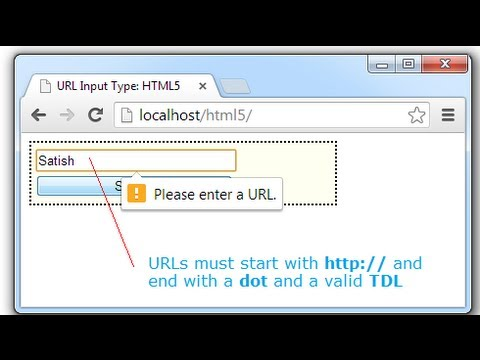
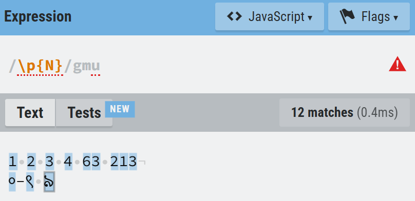

## Bài 2 - HTML

### Thẻ Comment(Chú thích):
Thẻ `<!-- ... -->` được sử dụng để chèn các chú thích(comment) vào trong mã HTML. Các chú thích này sẽ không được hiển thị trên trình duyệt và chỉ có tác dụng giúp người lập trình viên hiểu rõ hơn về mã nguồn.

### Thẻ căn chỉnh văn bản
- Thẻ `<br>` được sử dụng để chèn một ngắt dòng(break line) trong văn bản HTML. **Thẻ này không có thẻ đóng(hay còn được gọi là thẻ rỗng)**

    - **Ví dụ:**
        ```html
        <p>Đây là một ví dụ về thẻ <br> ngắt dòng.</p>
        ```

    - Kết quả:
        ```
        Đây là một ví dụ về thẻ 
        ngắt dòng.
        ```

- Thẻ `<hr>` được sử dụng để chèn một đường kẻ ngang phân chia nội dung trong trang HTML. **Thẻ này không có thẻ đóng(hay còn được gọi là thẻ rỗng)**

    - **Ví dụ:**
        ```html
        <p>Đoạn văn bản đầu tiên.</p>
        <hr>
        <p>Đoạn văn bản thứ hai.</p>
        ```

    - Kết quả:
        ```
        Đoạn văn bản đầu tiên.
        -----------------------
        Đoạn văn bản thứ hai.
        ```

### Thẻ Input, Label và Form trong HTML
- Thẻ `<input>` được sử dụng để tạo ra các trường nhập liệu trong HTML. **Thẻ này không có thẻ đóng(hay còn được gọi là thẻ rỗng)**
- Thẻ `<input` là một trong những thẻ mạnh mẽ và phức tạp nhất trong tất cả các thẻ HTML do số lượng lớn các loại trường nhập liệu và thuộc tính có thể kết hợp.
- Chú giải thuật ngữ:
    - `Trường nhập liệu`(**input field**): là một thuật ngữ trong lĩnh vực phát triển phần mềm và thiết kế giao diện người dùng. Nó đề cập đến một khu vực trên giao diện người dùng nơi người dùng có thể nhập dữ liệu. Trường nhập liệu thường xuất hiện dưới dạng các hộp văn bản, hộp chọn, hoặc các thành phần giao diện khác cho phép người dùng nhập thông tin.
- **Cấu trúc cơ bản**:
    ```html
    <input type="loại_input" name="tên_trường" value="giá_trị_mặc_định" placeholder="Gợi_ý">
    ```
    - Trong đó: 
        - `type`: là loại của trường nhập liệu.
        - `name`: Tên của trường nhập liệu, được sử dụng để xác định dữ liệu khi gửi biểu mẫu lên máy chủ. **Ghi chú**: Tên này sẽ được máy chủ dùng để xác định dữ liệu.
        - `value`: Giá trị mặc định của trường nhập liệu.
        - `placeholder`: Văn bản gợi ý hiển thị bên trong trường nhập liệu khi nó trống.
    - Ví dụ: 
        - Ví dụ 1: Trường nhập liệu kiểu văn bản
            ```html
            <input type="text" name="name" value="" placeholder="Nhập tên người dùng">
            ```

        - Ví dụ 2: Trường nhập liệu kiểu mật khẩu
            ```html
            <input type="password" name="password" value="" placeholder="Nhập mật khẩu">
            ```

        - Ví dụ 3: Trường nhập liệu kiểu email
            ```html
            <input type="email" name="email" value="" placeholder="Nhập địa chỉ email">
            ```

        - Ví dụ 4: Trường nhập liệu kiểu số
            ```html
            <input type="number" name="age" value="" placeholder="Nhập tuổi">
            ```

        - Ví dụ 5: Trường nhập liệu kiểu checkbox
            ```html
            <input type="checkbox" name="subscribe" value="yes"> Đăng ký nhận bản tin
            ```

        - Ví dụ 6: Trường nhập liệu kiểu radio
            ```html
            <input type="radio" name="gender" value="male"> Nam
            <input type="radio" name="gender" value="female"> Nữ
            ```

        - Ví dụ 7: Trường nhập liệu kiểu nút gửi
            ```html
            <input type="submit" value="Gửi">
            ```
    - Chi tiết các thuộc tính:
        - `type`: Xác định loại trường nhập liệu. Các giá trị bao gồm:
            - `text`: Trường nhập liệu văn bản một dòng thuần túy(Giá trị mặc định khi không chỉ định thuộc tính **type**).
            <br>
            - `button`: Nút nhấn. Ghi chú: Sử dụng cùng thuộc tính **value** để chỉ định tên của nút. Nút này thường được dùng để gắn một hành động cụ thể.
            <br>
            - `color`: Trường nhập liệu chọn màu sắc.
            <br>
            - `date`: Trường nhập liệu chọn ngày/tháng/năm.
            <br>
            - `datetime-local`: Trường nhập liệu chọn ngày/tháng/năm giờ:phút trạng_thái_mặt_trời.
            <br>
            - `time`: Trường nhập liệu giờ:phút trạng_thái_mặt_trời.
            <br>
            - `email`: Trường nhập liệu địa chỉ email. (Giống giá trị **text** nhưng có xác thực email).
            <br>
            - `file`: Trường nhập liệu chọn tệp. Có thể sử dụng kèm thuộc tính **accept**.
            <br>
            - `hidden`: Trường nhập liệu ẩn. (Thường sử dụng để lưu giá trị mà người dùng không nên được nhìn thấy).
            <br>
            - `image`: Nút gửi đồ họa(Tức có thể chỉ định một hình ảnh nút thay thế cho nút thường để nhìn đẹp hơn). Sử dụng kèm thuộc tính **src** để chỉ định đường dẫn hình ảnh nút.
            <br>
            - `month`: Trường nhập liệu chọn tháng năm.
            <br>
            - `number`: Trường nhập liệu số(có xác thực phải là số).
            <br>
            - `password`: Trường nhập liệu mật khẩu, văn bản nhập được che đi.
            <br>
            - `checkbox`: Hộp kiểm(Là các ô vuông cho phép chọn nhiều giá trị).
            <br>
            - `radio`: Radio(Là các ô tròn cho phép chọn một giá trị trong nhiều giá trị).
            <br>
            - `range`: Trường nhập liệu phạm vi(range). Giống như thanh tăng âm lượng.
            <br>
            - `reset`: Nút đặt lại nội dung của biểu mẫu về giá trị mặc định.
            <br>
            - `search`: Trường nhập liệu tìm kiếm(search). Giống **text** nhưng có thêm dấu X ở cuối và khi ấn enter sẽ tương đương với bấm nút **submit**.
            <br>
            - `submit`: Nút gửi biểu mẫu. Đừng nhầm với **button**, **submit** dùng để gửi dữ liệu biểu mẫu lên máy chủ.
            <br>
            - `tel`: Trường nhập liệu số điện thoại.
            <br>
            - `url`: Trường nhập liệu URL. Có xác thực dữ liệu URL.
            <br>
            - `week`: Trường nhập liệu tuần trong tháng.
            <br>
        - `accept`: Chỉ định các loại tệp mà người dùng được phép chọn. Ghi chú: Thuộc tính này chỉ có tác dụng đối với **type: file**. 
            <a id="structure_file"></a>
            - **Cấu trúc loại tệp**: 
                - `MIME/type`: Chấp nhận một loại tệp cụ thể, ví dụ: `image/*`(Chấp nhận ảnh có đuôi file bất kỳ(như **png**, **jpeg**, **svg**)), `image/png`(Chấp nhận ảnh có đuôi file là **png**), `image/jpeg`(Chấp nhận ảnh có đuôi file là **jpeg**), `video/*`, `video/mp4`, `video/avi`, `audio/*`, `audio/mp3`, ...
                - `.extension`: Chấp nhận một loại tệp cụ thể dựa trên phần mở rộng file, ví dụ: `.jpg`(Chấp nhận tệp có đuôi là **jpg**, không quan tâm có phải ảnh hay không), `.png`, `.svg`, `.mp4`, ...
            - VD:
            ```html
            <input type="file" accept="image/*">
            ```
        - `alt`: Thuộc tính này được sử dụng để cung cấp văn bản thay thế cho hình ảnh trong trường hợp hình ảnh không thể hiển thị(Giống thuộc tính **alt** trong thẻ ``). Ghi chú: Thuộc tính này chỉ có tác dụng đối với **type: image**.
        - `autocapitalize`: Xác định văn bản đã nhập có tự động được viết hoa hay không. Ghi chú: Thuộc tính này áp dụng cho tất cả các loại(type) nhập liệu ngoại trừ **type: url**, **type: email**, và **type: password**.
            - `none`: Không tự động viết hoa bất kỳ văn bản nào(Giá trị mặc định).
            - `sentences`: Viết hoa chữ cái đầu tiên của mỗi câu.
            - `words`: Viết hoa chữ cái đầu tiên của mỗi từ.
            - `characters`: Viết hoa tất cả các ký tự.
        - `autocomplete`: Xác định trình duyệt có nên tự động hoàn thành dữ liệu nhập của một trường nhập liệu(input) dựa trên dữ liệu đã nhập trước đó hay không. Ghi chú: Thuộc tính này áp dụng cho tất cả các loại(type) nhập liệu ngoại trừ **type: button**, **type: submit**, **type: image**, **type: checkbox**, và **type: radio**.
            - `on`: Bật tự động hoàn thành(Giá trị mặc định). Gợi ý dữ liệu dựa trên các lần nhập dữ liệu trước đó của người dùng.
            - `off`: Tắt tự động hoàn thành dữ liệu. Người dùng phải tự nhập tay dữ liệu.
            - `<token>`: Một từ khóa chỉ định gợi ý dữ liệu cụ thể cho người dùng dựa trên dữ liệu đã nhập trước đó của họ. Ghi chú: Khác với **on**, các từ khóa này sẽ giúp trình duyệt phân loại các dữ liệu gợi ý cho người dùng chính xác nhất dựa trên từ khóa đó thay vì gợi ý hỗn hợp các dữ liệu cho người dùng.
                <a id="token_full"></a>
                - `shipping`: Xác định rằng dữ liệu nhập sẽ là địa chỉ giao hàng hoặc thông tin liên hệ.
                - `billing`: Xác định rằng dữ liệu nhập sẽ là hóa đơn thanh toán hoặc thông tin thanh toán.
                - `home`: Xác định rằng dữ liệu nhập sẽ là nơi ở của người dùng.
                - `work`: Xác định rằng dữ liệu nhập sẽ là nơi làm việc của người dùng.
                - `mobile`: Xác định rằng dữ liệu nhập sẽ là thông tin liên hệ chính.
                - `tel`: Xác định rằng dữ liệu nhập sẽ là số điện thoại  của người dùng.
                - `email`: Xác định rằng dữ liệu nhập sẽ là email của người dùng.
                - `name`: Xác định rằng dữ liệu nhập sẽ là tên của người dùng.
                - `new-password`: Xác định rằng dữ liệu nhập sẽ là mật khẩu mới của người dùng.
                - `current-password`: Xác định rằng dữ liệu nhập sẽ là mật khẩu hiện tại của người dùng.
                - `organization`: Xác định rằng dữ liệu nhập sẽ là tên công ty hoặc tổ chức.
                - `street-address`: Xác định rằng dữ liệu nhập sẽ là địa chỉ cụ thể của người dùng.
                - `country`: Xác định rằng dữ liệu nhập sẽ là quốc gia của người dùng.
                - `sex`: Xác định rằng dữ liệu nhập sẽ là giới tình của người dùng.
                - `url`: Xác định rằng dữ liệu nhập sẽ là một đường dẫn URL.
                - `photo`: Xác định rằng dữ liệu nhập sẽ là một đường dẫn URL của ảnh đại diện.
            - VD:
                ```html
                <input type="text" name="name" autocomplete="name" placeholder="Nhập tên người dùng">

                <input type="password" name="password" autocomplete="current-password" placeholder="Nhập mật khẩu hiện tại">

                <input type="email" name="email" autocomplete="email" placeholder="Nhập địa chỉ email">

                <input type="tel" name="phone" autocomplete="tel" placeholder="Nhập số điện thoại">

                <input type="text" name="address" autocomplete="shipping street-address" placeholder="Nhập địa chỉ giao hàng">

                <input type="url" name="website" autocomplete="on" placeholder="Nhập URL trang web">
                ```
        - `autofocus`: (Thuộc tính boolean) Tự động lấy tiêu điểm(focus) vào phần tử này khi trang web được tải. Tương đương với việc chọn vào phần tử nhập liệu nhưng nó sẽ tự chọn. **Lưu ý: Chỉ nên có một thuộc tính *autofocus* của biểu mẫu(form) trong cùng tài liệu**.
            - VD:
                ```html
                <input type="text" name="name" autofocus placeholder="Nhập tên người dùng">
                ```
        - `capture`: Chỉ định rằng thiết bị đầu vào của người dùng(như máy ảnh hoặc micro) sẽ được sử dụng để thu thập dữ liệu file thay vì tải file lên. Ghi chú: Thuộc tính này chỉ có tác dụng đối với **type: file** và **chỉ hoạt động đối với trình duyệt di động**.
            - `user`: Sử dụng máy ảnh hoặc micro hướng về phía người dùng. Thường là cam trước.
            - `environment`: Sử dụng máy ảnh hoặc micro hướng về phía ngoài. Thường là cam sau.
        - `checked`: (Thuộc tính boolean) Chỉ định phần tử nhập liệu *checkbox* hoặc *radio* được chọn mặc định khi trang được tải. Ghi chú: Thuộc tính này chỉ có tác dụng đối với **type: checkbox** và **type: radio**.
            - Ví dụ:
                - Ví dụ 1: Checkbox được chọn mặc định
                    ```html
                    <input type="checkbox" name="subscribe" value="yes" checked> Đăng ký nhận bản tin
                    ```
                - Ví dụ 2: Radio button được chọn mặc định
                    ```html
                    <input type="radio" name="gender" value="male" checked> Nam
                    <input type="radio" name="gender" value="female"> Nữ
                    ```
        - `disabled`: (Thuộc tính boolean) được sử dụng để vô hiệu hóa phần tử nhập liệu. Người dùng sẽ không thể tương tác được với phần tử nhập liệu đó nữa.
            - Ví dụ:
                ```html
                <input type="text" name="name" value="Hiroki" disabled>
                ```
        - `form`: Xác định biểu mẫu mà dữ liệu của phần tử `<input>` thuộc về. Giá trị của thuộc tính này phải là giá trị `id` của phần tử `<form>` trong cùng tài liệu.
            - Ví dụ:
                ```html
                <form id="myForm"></form>
                    <label for="username">Tên người dùng:</label>
                    <input type="text" id="username" name="username" form="myForm" placeholder="Nhập tên người dùng">
                ```
        - `formaction`: Xác định URL của máy chủ mà dữ liệu biểu mẫu sẽ được gửi đến khi người dùng nhấp vào nút gửi. Ghi chú: Giá trị của thuộc tính này sẽ ghi đè giá trị của thuộc tính `action` của thẻ `<form>` chứa. Ghi chú: Thuộc tính này chỉ có tác dụng đối với các phần tử `<input>` có **type** là **submit** hoặc **image**.
            - Ví dụ:
                ```html
                <form action="/default-action">
                    <input type="submit" formaction="/custom-action" value="Gửi">
                </form>
                ```
        - `formmethod`: Xác định phương thức HTTP được sử dụng để gửi dữ liệu biểu mẫu khi người dùng nhấp vào nút gửi. Giá trị có thể là `get`, `post` hoặc `dialog`. Ghi chú: Giá trị của thuộc tính này sẽ ghi đè giá trị của thuộc tính `method` của thẻ `<form>` chứa Ghi chú: Thuộc tính này chỉ có tác dụng đối với các phần tử `<input>` có **type** là **submit** hoặc **image**.
            - Ví dụ:
                ```html
                <form action="/submit-form">
                    <input type="submit" formmethod="post" value="Gửi bằng POST">
                    <input type="submit" formmethod="get" value="Gửi bằng GET">
                </form>
                ```
        - `width`: Xác định chiều rộng hình ảnh của nút gửi đồ họa. Ghi chú: Thuộc tính này chỉ có tác dụng đối với **type: image**.
        - `height`: Xác định chiều cao hình ảnh của nút gửi đồ họa. Ghi chú: Thuộc tính này chỉ có tác dụng đối với **type: image**.
        - `id`: Id duy nhất cho phần tử nhập liệu, để liên kết nhãn(label) với phần tử nhập liệu.
        - `inputmode`: Cung cấp gợi ý cho trình duyệt về loại bàn phím ảo nên sử dụng khi nhập dữ liệu trong phần tử nhập liệu này.
            - `none`: Không hiển thị bàn phím ảo.
            - `text`: Hiển thị bàn phím nhập văn bản thông thường.
            - `tel`: Hiển thị bàn phím nhập số điện thoại.
            - `url`: Hiển thị bàn phím nhập URL.
            - `email`: Hiển thị bàn phím nhập email.
            - `numeric`: Hiển thị bàn phím số.
            - `decimal`: Hiển thị bàn phím số thập phân.
            - `search`: Hiển thị bàn phím tìm kiếm.
            - Thường trên điện thoại khi nhấp vào phần tử nhập liệu, trình duyệt sẽ hiển thị bàn phím thường có cả chữ và số. Nhưng khi chỉ định thuộc tính này thì trình duyệt sẽ hiển thị bàn phím phù hợp với giá trị cung cấp, như với giá trị `numeric` thì trình duyệt sẽ hiển thị bàn phím chỉ có số để nhập dữ liệu.
            - Ví dụ: 
            <br>
        - `list`: Liên kết một trường nhập liệu với một danh sách các giá trị tùy chọn có sẵn được xác định trước để gợi ý cho người dùng. Giá trị của thuộc tính này phải là giá trị `id` của phần tử `<datalist>` trong cùng một tài liệu.
            - Ví dụ: 
                ```html
                <input type="text" list="browsers">
                <datalist id="browsers">
                   <option value="Chrome">
                   <option value="Firefox">
                   <option value="Safari">
                   <option value="Edge">
                   <option value="Opera">
                </datalist>
                ```
        - `max` và `min`: (Ghi chú: Các thuộc tính này chỉ có tác dụng đối với các loại(type) **date, month, week, time, datetime-local, number, và range**)
            - `max`: Xác định giá trị lớn nhất mà dữ liệu nhập của trường nhập liệu có thể có. Dữ liệu nhập không thể vượt quá giá trị này. Lưu ý: Thuộc tính này phải có giá trị lớn hơn thuộc tính `min`.
            - `min`: Xác định giá trị nhỏ nhất mà dữ liệu nhập của trường nhập liệu có thể có. Dữ liệu nhập không thể nhỏ hơn giá này nếu không sẽ không thể gửi dữ liệu lên server(máy chủ) vì bị xác thực. Lưu ý: Thuộc tính này phải có giá trị nhỏ hơn thuộc tính `max`.
            - Ví dụ:
                - Ví dụ 1: Trường nhập liệu kiểu số với giá trị tối thiểu và tối đa
                    ```html
                    <input type="number" name="quantity" min="1" max="10" placeholder="Nhập số lượng (1-10)">
                    ```

                - Ví dụ 2: Trường nhập liệu kiểu ngày với giá trị tối thiểu và tối đa. (Lưu ý: Trong lập trình định dạng ngày tháng có cấu trúc: `Năm-tháng-ngày`)
                    ```html
                    <input type="date" name="birthday" min="1900-01-01" max="2023-12-31" placeholder="Chọn ngày sinh">
                    ```

                - Ví dụ 3: Trường nhập liệu kiểu phạm vi với giá trị tối thiểu và tối đa
                    ```html
                    <input type="range" name="volume" min="0" max="100">
                    ```

                - Ví dụ 4: Trường nhập liệu kiểu thời gian với giá trị tối thiểu và tối đa
                    ```html
                    <input type="time" name="alarm" min="06:00" max="22:00" placeholder="Chọn thời gian báo thức">
                    ```
        - `maxlength` và `minlength`: (Ghi chú: Các thuộc tính này chỉ có tác dụng đối với các loại(type) **text, search, url, tel, email, và password**)
            - `maxlength`: Xác định độ dài chuỗi ký tự tối đa mà người dùng có thể nhập vào trường nhập liệu. Chuỗi ký tự nhập không thể vượt quá giá trị này. **Giá trị của thuộc tính này phải là một số nguyên dương**. Ghi chú: Khác với `max` chỉ áp dụng cho dữ liệu kiểu số, ngày, tháng, thời gian, thì `maxlength` áp dụng cho dữ liệu kiểu văn bản. Lưu ý: Thuộc tính này phải có giá trị lớn hơn thuộc tính `minlength`.
            - `minlength`: Xác định độ dài chuỗi ký tự tối thiểu mà người dùng có thể nhập vào trường nhập liệu. Chuỗi ký tự nhập không thể ít hơn độ dài tối thiểu này nếu không sẽ không thể gửi dữ liệu lên server(máy chủ) vì bị xác thực ràng buộc. **Giá trị của thuộc tính này phải là một số nguyên dương**. Ghi chú: Khác với `min` chỉ áp dụng cho dữ liệu kiểu số, ngày, tháng, thời gian, thì `minlength` áp dụng cho dữ liệu kiểu văn bản. Lưu ý: Thuộc tính này phải có giá trị nhỏ hơn thuộc tính `maxlength`.
            - Ví dụ: 
                - Ví dụ 1: Trường nhập liệu văn bản với độ dài tối thiểu và tối đa
                    ```html
                    <input type="text" name="name" minlength="5" maxlength="15" placeholder="Nhập tên người dùng (5-15 ký tự)">
                    ```

                - Ví dụ 2: Trường nhập liệu mật khẩu với độ dài tối thiểu và tối đa
                    ```html
                    <input type="password" name="password" minlength="8" maxlength="20" placeholder="Nhập mật khẩu (8-20 ký tự)">
                    ```

                - Ví dụ 3: Trường nhập liệu tìm kiếm với độ dài tối thiểu và tối đa
                    ```html
                    <input type="search" name="code" minlength="3" maxlength="20" placeholder="Nhập từ khóa(3-20 ký tự)">
                    ```
        - `multiple`: (Thuộc tính boolean) Cho phép người dùng nhập hoặc chọn nhiều giá trị dữ liệu cùng một lúc. Như với file, người dùng có thể chọn nhiều file cùng một lúc để tải lên. Như với email, người dùng có thể nhập nhiều địa chỉ email trong cùng một trường nhập liệu và được phân cách bằng dấu phẩy(`,`). Ghi chú: Thuộc tính này chỉ có tác dụng đối với **type: file** và **type: email**
            - Ví dụ: 
                - File:
                    ```html
                    <input type="file" name="files" multiple>
                    ```
                - Email
                    ```html
                    <input type="email" name="emails" multiple placeholder="Nhập các địa chỉ email, phân cách bằng dấu phẩy">
                    ```
        - `name`: Xác định tên của trường nhập liệu. Tên này sẽ được gửi cùng với dữ liệu của biểu mẫu lên máy chủ và được sử dụng để xác định và xử lý dữ liệu đó.
        - `pattern`: Xác định một biểu thức chính quy(regular expression) mà giá trị nhập của trường nhập liệu phải tuân theo, giúp kiểm tra và xác thực dữ liệu người dùng nhập. Ghi chú: Nếu sử dụng thuộc tính này thì nên sử dụng kèm với thuộc tính `title` để hiển thị định dạng mà người dùng cần nhập. Ghi chú: Thuộc tính này chỉ có tác dụng đối với loại(type) **text, search, url, tel, email, và password**.
            - [Xem thêm biểu chính quy bên dưới để biết cách chỉ định](#biểu-thức-chính-quy)
        - `placeholder`: Hiển thị một văn bản gợi ý bên trong ô nhập liệu khi người dùng chưa nhập bất kỳ giá trị nào. Văn bản gợi ý này sẽ biến mất khi người dùng bắt đầu nhập liệu. Ghi chú: Thuộc tính này chỉ có tác dụng đối với loại(type) **text, search, url, tel, email, password, và number**. 
        - `readonly`: (Thuộc tính boolean) Chỉ định trường nhập liệu chỉ có thể đọc và không thể chỉnh sửa. Ghi chú: Thuộc tính này áp dụng cho tất cả các loại(type) nhập liệu ngoại trừ loại(type) **hidden, range, color, checkbox, radio, button, submit, và image**.
        - `required`: (Thuộc tính boolean) Chỉ định trường nhập liệu phải được điền giá trị trước khi gửi biểu mẫu. Ghi chú: Thuộc tính này áp dụng cho tất cả các loại(type) nhập liệu ngoại trừ loại(type) **hidden, range, color, button, submit, và image**.
        - `size`: Xác định kích thước chiều rộng hiển thị của một phần tử nhập liệu. Ghi chú: Giá trị của thuộc tính này phải là một số nguyên dương. Giá trị mặc định là **20**. Ghi chú: Thuộc tính này chỉ có tác dụng đối với loại(type) **text, search, url, tel, email, và password**.
        - `src`: Chỉ định đường dẫn URL đến tệp hình ảnh nút đồ họa. Có thể là đường dẫn tuyệt đối hoặc đường dẫn tương đối. Thuộc tính này chỉ có tác dụng đối với **type: image**.
        - `step`: Xác định bước nhảy giữa các giá trị hợp lệ trong một trường nhập liệu(input). Ví dụ nếu giá trị của thuộc tính này được thiết lập là **2**, thì khi nhập dữ liệu, người dùng phải nhập các giá trị số chẵn như **0**, **2**, **4**, v.v.v vì bước nhảy là **2** tức nó sẽ nhảy lên 2 lần thay vì 1 lần, và nếu nhập các giá trị số lẻ thì nó sẽ bị xác thực ràng buộc. Giá trị của thuộc tính này phải là một số nguyên dương, số thực, hoặc giá trị đặc biệt `any`(cho phép bất kỳ giá trị bước nhảy nào). Nếu thuộc tính này không được chỉ định, giá trị mặc định sẽ là `1`, chỉ đối với **type: number** và **type: range**. Ghi chú: Thuộc tính này chỉ có tác dụng đối với loại(type) **date, month, week, time, datetime-local, number, và range**.
            - Ví dụ: 
                <br>
        - `title`: Cung cấp thông tin bổ sung về trường nhập liệu. Khi người dùng di chuột qua trường nhập liệu(input), nội dung của thuộc tính `title` sẽ hiển thị dưới dạng tooltip(chú thích nhỏ). Có thể sử dụng cùng với thuộc tính `pattern` để cung cấp một chú giải công cụ về định dạng mong muốn:
            - Ví dụ:
                ```html
                <input type="text" name="username" pattern="[A-Za-z0-9]{5,10}" title="Tên người dùng phải có từ 5 đến 10 ký tự và chỉ chứa chữ cái và số. VD: Hiep" placeholder="Nhập tên người dùng">
                ```
            - Kết quả:
                <br>
        - `value`: Xác định giá trị mặc định cho trường nhập liệu(input) khi trang web được tải. Ghi chú: Thuộc tính này áp dụng cho tất cả các loại(type) nhập liệu ngoại trừ loại(type) **image**.
        - `webkitdirectory`: (Thuộc tính boolean) Cho phép người dùng chọn tải toàn bộ file trong thư mục thay vì chỉ chọn từng tệp riêng lẻ. Khi được chỉ định người dùng chỉ có thể upload(tải) thư mục, không được chọn tệp riêng lẻ. Thuộc tính này chỉ được hỗ trợ trên trình duyệt máy tính. Thuộc tính này chỉ có tác dụng đối với **type: file**.
    ---
- Thẻ `<label>` được sử dụng để xác định nhãn(hay tiêu đề) cho các phần tử nhập liệu trong biểu mẫu. Nhãn giúp người dùng hiểu rõ hơn về mục đích của các trường nhập liệu và cải thiện khả năng truy cập của biểu mẫu.
    - **Cấu trúc cơ bản**:
        ```html
        <label for="id_truong_nhap_lieu">Nhãn</label>
        <input type="text" id="id_truong_nhap_lieu" name="ten_truong_nhap_lieu">
        ```
        - Trong đó:
            - `for`: Thuộc tính này liên kết nhãn với phần tử nhập liệu bằng cách sử dụng giá trị `id` của phần tử nhập liệu. **Khi người dùng nhấp vào nhãn, phần tử nhập liệu tương ứng sẽ được chọn(như được bấm bởi người dùng)**.
            - `id`: Thuộc tính này xác định một định danh(id) duy nhất cho phần tử nhập liệu, giúp phân biệt giữa các phần tử nhập liệu.
    - Ví dụ:
        ```html
        <label for="username">Tên người dùng:</label>
        <input type="text" id="username" name="username" placeholder="Nhập tên người dùng">
        ```
    - **Công dụng**:
        - **Cải thiện khả năng truy cập**: Nhãn giúp người dùng, đặc biệt là những người sử dụng công cụ hỗ trợ(là công cụ dành cho người khiếm thính, kiếm thị), hiểu rõ hơn về mục đích của các trường nhập liệu.
        - **Tăng tính tương tác**: Khi người dùng nhấp vào nhãn, phần tử nhập liệu tương ứng sẽ được chọn, giúp cải thiện trải nghiệm người dùng.
    ---
- Thẻ `<form>` được sử dụng để tạo ra một biểu mẫu(form) trên trang web, cho phép người dùng nhập dữ liệu và gửi dữ liệu đó đến máy chủ để xử lý.
- Thẻ `<form>` thường bao bọc các thẻ `<input>` để lấy dữ liệu người dùng nhập trong thẻ `<input>` và gửi nó đến **server(máy chủ)**
- Lưu ý: 
    - **Đừng nhầm lẫn rằng không có thẻ `<form>` này thì sẽ không thể tạo ra một biểu mẫu được. Thực chất `<form>` không ảnh hưởng đến giao diện trang web hay biểu mẫu nhưng bắt buộc phải có thẻ này khi sử dụng với biểu mẫu. Bởi vì nếu như không có thẻ này thì dữ liệu người dùng điền vào biểu mẫu là tĩnh(tức là máy chủ sẽ không biết người dùng điền gì và sẽ không thể xử lý) và do đó dữ liệu đó sẽ không có tác dụng gì cho có điền hay không**
- Chú giải thuật ngữ:
    - `Biểu mẫu`(**Form**): là một tập hợp các **trường nhập liệu**(input field) cho phép người dùng nhập thông tin. Biểu mẫu thường được sử dụng trong các ứng dụng web và phần mềm để thu thập dữ liệu nhập từ người dùng. Biểu mẫu giúp tổ chức và quản lý thông tin một cách hiệu quả và rõ ràng.
- **Cấu trúc cơ bản**:
    ```html
    <form action="máy_chủ_xử_lý" method="phương_thức_gửi_dữ_liệu">
        <label>Nhãn</label>
        <input type='loại_input' placeholder="tên_gợi_ý">
        <button>Nút gửi</button>
    </form>
    ```
    - Giải thích:
        - `action`: URL của máy chủ mà dữ liệu biểu mẫu sẽ được gửi đến.
        - `method`: Phương thức gửi dữ liệu, có thể là `get` hoặc `post`.
        - `label`: Nhãn cho trường nhập liệu.
        - `input`: Trường nhập liệu, với thuộc tính `type` xác định loại trường nhập liệu(ví dụ: `text` cho văn bản, `submit` cho nút gửi).
    - Chi tiết các thuộc tính: 
        - `accept-charset`: Xác định bộ mã hóa ký tự(như `UTF-8`, `ASCII`, `ISO-8859-1`, v.v.v) mà dữ liệu của biểu mẫu sẽ được mã hóa. Khuyến nghị lên sử dụng bộ mã hóa `UTF-8`. 
        - `autocapitalize`: Xác định văn bản nhập trong ô nhập liệu có tự động được viết hoa hay không.
            - `none`: Không tự động viết hoa bất kỳ văn bản nào(Giá trị mặc định).
            - `sentences`: Viết hoa chữ cái đầu tiên của mỗi câu.
            - `words`: Viết hoa chữ cái đầu tiên của mỗi từ.
            - `characters`: Viết hoa tất cả các ký tự.
        - `autocomplete`: Xác định trình duyệt có nên tự động hoàn thành dữ liệu nhập của các trường nhập liệu(input) dựa trên dữ liệu đã nhập trước đó hay không. Ghi chú: Thuộc tính này sẽ bị ghi đè trên các phần tử nhập liệu chỉ định thuộc tính `autocomplete`.
             - `on`: Bật tự động hoàn thành(Giá trị mặc định). Gợi ý dữ liệu dựa trên các lần nhập dữ liệu trước đó của người dùng.
            - `off`: Tắt tự động hoàn thành dữ liệu. Người dùng phải tự nhập tay dữ liệu.
        - `action`: URL của máy chủ mà dữ liệu biểu mẫu sẽ được gửi đến. Thuộc tính này sẽ bị bỏ qua nếu phương thức(`method` là `dialog`)(Giá trị mặc định là URL hiện tại).
        - `method`: Phương thức gửi dữ liệu biểu mẫu:
            <a id="explain_method"></a>
            <br>
            - `post`: Gửi dữ liệu biểu mẫu trong phần thân của yêu cầu(request) HTTP. Ở ví dụ hình ảnh trên, phương thức `post` sẽ gửi dữ liệu biểu mẫu lên máy chủ mà không để lộ bất kỳ thông tin nào ra ngoài, tức thông tin sẽ được ẩn đi. Phương thức này thường được sử dụng cho các dữ liệu nhảy cảm như mật khẩu(password), chứng chỉ, thông tin thanh toán, v.v.v
            - `get`: Gửi dữ liệu biểu mẫu dưới dạng chuỗi truy vấn(query string). Ở ví dụ hình ảnh trên, phương thức `get` sẽ gửi dữ liệu biểu mẫu lên máy chủ thông qua chuỗi truy vấn, chuỗi này sẽ được nối vào trong URL với cú pháp `?tên_trường_1=giá_trị_1&...&tên_trường_n=giá_trị_n`.
                - Trong đó:
                    - `tên_trường`: Là giá trị thuộc tính `name` của trường nhập liệu.
                    - `giá_trị`: là giá trị mà người dùng nhập trong trường nhập liệu.
                    - Ở ví dụ hình ảnh, ta đọc được dữ liệu như sau: tên trường là `date`(thời gian) và giá trị là một số `20130528`(chắc là số mili giây).
                - Như bạn có thế thấy rằng dữ liệu ở đây khá là dễ nhận thấy và dễ đọc. Vì vậy mà phương thức này thường được sử dụng cho dữ liệu không nhạy cảm như từ khóa tìm kiếm, thông tin sản phẩm, v.v.v. **Chắc chắn bạn sẽ có thắc mắc là tại sao `get` bảo mật kém vậy mà vẫn được sử dụng, sao không sử dụng `post`? Thì câu trả lời cho câu hỏi này là phương thức `get` sẽ *gửi dữ liệu nhanh hơn* so với phương thức `post` do nó không cần phải gửi dữ liệu trong tiêu đề HTTP nên sẽ không tốn hiệu suất như `post`**
            - `dialog`: Nếu sử dụng trong ngữ cảnh của một hộp thoại `<dialog>` thì sẽ đóng hộp thoại đó và không gửi dữ liệu đến máy chủ.
        - `target`: Xác định nơi hiển thị kết quả phản hồi khi biểu mẫu được gửi đi.
            - `_self`: Hiển thị kết quả phản hồi trong cùng một cửa sổ(hoặc tab)(Giá trị mặc định).
            - `_blank`: Hiển thị kết quả phản hồi trong một cửa sổ(hoặc tab) mới.

### Thẻ gợi ý dữ liệu (Data List):
- Thẻ `<datalist>`: Định nghĩa một danh sách các tùy chọn trước cho một trường nhập liệu(`<input>`). Khi người dùng nhập vào trường nhập liệu, các tùy chọn trong danh sách sẽ được hiển thị để người dùng có thể chọn.
    - `id`: Xác định id duy nhất cho phần tử. Thường được sử dụng để liên kết với thuộc tính `list` của thẻ `<input>`. Khi người dùng nhập vào trường `<input>`, danh sách các tùy chọn trong `<datalist>` sẽ được hiển thị ra và gợi ý cho họ. Thuộc tính này là bắt buộc khi sử dụng thẻ `<datalist>`.
    - Ví dụ:
        ```html
        <label for="browser">Chọn trình duyệt:</label>
        <input list="browsers" id="browser" name="browser" placeholder="Chọn trình duyệt yêu thích">
        <datalist id="browsers">
            <option value="Chrome">
            <option value="Firefox">
            <option value="Safari">
            <option value="Edge">
            <option value="Opera">
        </datalist>
        ```
- Thẻ `<option>` được sử dụng để định nghĩa từng tùy chọn trong danh sách dữ liệu. Ghi chú: Thẻ này phải là thẻ con của thẻ `<datalist>`, `<select>` và `<optgroup>`.
    - `disabled`: (Thuộc tính boolean) Vô hiệu hóa một tùy chọn, làm cho nó không thể chọn được.
        - Ví dụ:
            ```html
            <option value="apple" disabled>Apple</option>
            ```
    - `label`: Cung cấp một nhãn hiển thị cho tùy chọn, khác với giá trị của nó.
        - Ví dụ:
            ```html
            <option value="apple" label="Apple Fruit">Apple</option>
            ```

    - `selected`: (Thuộc tính boolean) Đặt tùy chọn mặc định được chọn khi trang được tải.
        - Ví dụ:
            ```html
            <option value="apple" selected>Apple</option>
            ```

    - `value`: Xác định giá trị của tùy chọn khi nó được chọn. Giá trị này sẽ được sử dụng bởi server(máy chủ).
        - Ví dụ:
            ```html
            <option value="apple">Apple</option>
            ```
- Thẻ `<optgroup>`: Tạo một nhóm các tùy chọn(`<option>`) trong một danh sách thả xuống(`<select>`). Giúp cải thiện khả năng tổ chức và dễ dàng tìm kiếm các tùy chọn trong danh sách dài. Ghi chú: Thẻ này phải là thẻ con của thẻ `<select>` và chứa các thẻ `<option>`.
    - `disabled`: (Thuộc tính boolean) Vô hiệu hóa toàn bộ nhóm tùy chọn, người dùng sẽ không thể chọn bất kỳ tùy chọn nào trong nhóm này.
    - `label`: Xác định nhãn(hay tên) cho nhóm tùy chọn, giúp người dùng dễ dàng nhận biết nhóm này chứa các tùy chọn gì.
    - Ví dụ:
        ```html
        <select autocomplete="on">
            <optgroup label="Trái cây">
                <option value="apple">Táo</option>
                <option value="banana">Chuối</option>
                <option value="orange">Cam</option>
            </optgroup>
            <optgroup label="Rau củ">
                <option value="carrot">Cà rốt</option>
                <option value="broccoli">Bông cải xanh</option>
                <option value="spinach">Rau chân vịt</option>
            </optgroup>
        </select>
        ```

### Các thẻ nhập liệu khác:
- Thẻ `<select>`: Tạo một danh sách thả xuống cho phép người dùng chọn một hoặc nhiều tùy chọn.
    - `autocomplete`: Chỉ định xem trình duyệt có nên cung cấp gợi ý tự động hoàn thành dữ liệu chọn cho người dùng dựa trên dữ liệu đã chọn trước đó hay không.
        - `off`: Tắt tự động hoàn thành.
        - `on`: Bật tự động hoàn thành.
        - `<token>`: Một từ khóa chỉ định gợi ý dữ liệu cụ thể cho người dùng dựa trên dữ liệu đã chọn trước đó của họ.
            <a id="token_full1"></a>
            - `shipping`: Xác định rằng dữ liệu chọn sẽ là địa chỉ giao hàng hoặc thông tin liên hệ.
            - `billing`: Xác định rằng dữ liệu chọn sẽ là hóa đơn thanh toán hoặc thông tin thanh toán.
            - `home`: Xác định rằng dữ liệu chọn sẽ là nơi ở của người dùng.
            - `work`: Xác định rằng dữ liệu chọn sẽ là nơi làm việc của người dùng.
            - `mobile`: Xác định rằng dữ liệu chọn sẽ là thông tin liên hệ chính.
            - `tel`: Xác định rằng dữ liệu chọn sẽ là số điện thoại  của người dùng.
            - `email`: Xác định rằng dữ liệu chọn sẽ là email của người dùng.
            - `name`: Xác định rằng dữ liệu chọn sẽ là tên của người dùng.
            - `new-password`: Xác định rằng dữ liệu chọn sẽ là mật khẩu mới của người dùng.
            - `current-password`: Xác định rằng dữ liệu chọn sẽ là mật khẩu hiện tại của người dùng.
            - `organization`: Xác định rằng dữ liệu chọn sẽ là tên công ty hoặc tổ chức.
            - `street-address`: Xác định rằng dữ liệu chọn sẽ là địa chỉ cụ thể của người dùng.
            - `country`: Xác định rằng dữ liệu chọn sẽ là quốc gia của người dùng.
            - `sex`: Xác định rằng dữ liệu chọn sẽ là giới tình của người dùng.
            - `url`: Xác định rằng dữ liệu chọn sẽ là một đường dẫn URL.
            - `photo`: Xác định rằng dữ liệu chọn sẽ là một đường dẫn URL của ảnh đại diện.
    - `autofocus`: (Thuộc tính boolean) Tự động lấy tiêu điểm(focus) phần tử khi trang web được tải. **Lưu ý: Chỉ nên có một thuộc tính *autofocus* của biểu mẫu(form) trong cùng tài liệu**.
    - `disabled`: (Thuộc tính boolean) Vô hiệu hóa phần tử, người dùng không thể tương tác với nó.
    - `form`: Xác định biểu mẫu(form) mà dữ liệu của phần tử `<select>` thuộc về. Giá trị của thuộc tính này phải là giá trị `id` của phần tử `<form>` trong cùng tài liệu.
    - `multiple`: (Thuộc tính boolean) Cho phép người dùng chọn nhiều tùy chọn. 
    - `name`: Xác định tên của trường nhập liệu danh sách chọn.
    - `required`: (Thuộc tính boolean) Bắt buộc người dùng phải chọn một giá trị trước khi gửi biểu mẫu.
    - `size`: Xác định số lượng tùy chọn hiển thị trong danh sách thả xuống(Giá trị mặc định là **0**). Lưu ý: Thuộc tính này chỉ có tác dụng nếu thuộc tính `multiple` được chỉ định và chỉ có sẵn trên trình duyệt máy tính.
    - Ví dụ:
        ```html
        <select name="hometown" id="hometown">
            <option value="HCM">Hồ Chí Minh</option>
            <option value="HaNoi">Hà Nội</option>
            <option value="LaoCai">Lào Cai</option>
            <option value="DaNang">Đà Nẵng</option>
        </select>
        ```
- Thẻ `<textarea>`: Tạo một trường nhập liệu văn bản thô nhiều dòng.
    - `autocapitalize`: Xác định văn bản nhập có tự động được viết hoa hay không.
        - `none`: Không tự động viết hoa bất kỳ văn bản nào(Giá trị mặc định).
        - `sentences`: Viết hoa chữ cái đầu tiên của mỗi câu.
        - `words`: Viết hoa chữ cái đầu tiên của mỗi từ.
        - `characters`: Viết hoa tất cả các ký tự.
    - `autocomplete`: Xác định xem trình duyệt có nên tự động hoàn thành dữ liệu nhập của người dùng dựa trên dữ liệu đã nhập trước đó hay không.
        - `off`: Tắt tự động hoàn thành.
        - `on`: Bật tự động hoàn thành.
        - `<token>`: Một từ khóa chỉ định gợi ý dữ liệu cụ thể cho người dùng dựa trên dữ liệu đã nhập trước đó của họ.
            <a id="token_full2"></a>
            - `shipping`: Xác định rằng dữ liệu nhập sẽ là địa chỉ giao hàng hoặc thông tin liên hệ.
            - `billing`: Xác định rằng dữ liệu nhập sẽ là hóa đơn thanh toán hoặc thông tin thanh toán.
            - `home`: Xác định rằng dữ liệu nhập sẽ là nơi ở của người dùng.
            - `work`: Xác định rằng dữ liệu nhập sẽ là nơi làm việc của người dùng.
            - `mobile`: Xác định rằng dữ liệu nhập sẽ là thông tin liên hệ chính.
            - `tel`: Xác định rằng dữ liệu nhập sẽ là số điện thoại  của người dùng.
            - `email`: Xác định rằng dữ liệu nhập sẽ là email của người dùng.
            - `name`: Xác định rằng dữ liệu nhập sẽ là tên của người dùng.
            - `new-password`: Xác định rằng dữ liệu nhập sẽ là mật khẩu mới của người dùng.
            - `current-password`: Xác định rằng dữ liệu nhập sẽ là mật khẩu hiện tại của người dùng.
            - `organization`: Xác định rằng dữ liệu nhập sẽ là tên công ty hoặc tổ chức.
            - `street-address`: Xác định rằng dữ liệu nhập sẽ là địa chỉ cụ thể của người dùng.
            - `country`: Xác định rằng dữ liệu nhập sẽ là quốc gia của người dùng.
            - `sex`: Xác định rằng dữ liệu nhập sẽ là giới tình của người dùng.
            - `url`: Xác định rằng dữ liệu nhập sẽ là một đường dẫn URL.
            - `photo`: Xác định rằng dữ liệu nhập sẽ là một đường dẫn URL của ảnh đại diện.
    - `autocorrect`: Xác định xem trình duyệt có nên tự động sửa lỗi chính tả hay không.
        - `on`: Bật tính năng tự động sửa lỗi chính tả.
        - `off`: Tắt tính năng tự động sửa lỗi chính tả(Giá trị mặc định).
    - `autofocus`: (Thuộc tính boolean) Tự động lấy tiêu điểm(focus) phần tử khi trang web được tải. **Lưu ý: Chỉ nên có một thuộc tính *autofocus* của biểu mẫu(form) trong cùng tài liệu**.
    - `cols`: Xác định chiều rộng hiển thị của vùng nhập liệu. Giá trị của thuộc tính này phải là một số nguyên dương, giá trị mặc định là **20**.
    - `disabled`: (Thuộc tính boolean) Vô hiệu hóa trường nhập liệu, người dùng không thể tương tác với nó.
    - `form`: Xác định biểu mẫu(form) mà dữ liệu của phần tử `<textarea>` thuộc về. Giá trị của thuộc tính này phải là giá trị `id` của phần tử `<form>` trong cùng tài liệu.
    - `maxlength`: Xác định độ dài chuỗi ký tự nhập tối đa của trường nhập liệu. Giá trị của thuộc tính này phải là một số nguyên dương.
    - `minlength`: Xác định độ dài chuỗi ký tự nhập tối thiểu của trường nhập liệu. Giá trị của thuộc tính này phải là một số nguyên dương.
    - `name`: Xác định tên của trường nhập liệu văn bản.
    - `placeholder`: Hiển thị một văn bản gợi ý bên trong ô nhập liệu khi người dùng chưa nhập bất kỳ giá trị nào. Văn bản gợi ý này sẽ biến mất khi người dùng bắt đầu nhập liệu.
    - `readonly`: (Thuộc tính boolean) Chỉ định trường nhập liệu chỉ có thể đọc và không thể chỉnh sửa.
    - `required`: (Thuộc tính boolean) Chỉ định trường nhập liệu phải được điền giá trị trước khi gửi biểu mẫu.
    - `rows`: Xác định số lượng dòng văn bản có thể nhìn thấy của vùng nhập liệu. Giá trị của thuộc tính này phải là một số nguyên dương, giá trị mặc định là **2**.
    - `spellcheck`: Xác định xem trình duyệt có nên kiểm tra chính tả theo gợi ý của hệ điều hành hay không.
        - `true`: Bật tính năng kiểm tra chính tả và ngữ pháp.
        - `default`: Tính năng kiểm tra chính tả và ngữ pháp sẽ được bật/tắt tùy thuộc vào cài đặt và ngữ cảnh của người dùng(Giá trị mặc định).
        - `false`: Tắt tính năng kiểm tra chính tả và ngữ pháp.
    - Ví dụ:
        ```html
        <label for="comments">Bình luận:</label>
        <textarea id="comments" name="comments" rows="4" cols="50" placeholder="Nhập bình luận của bạn" required></textarea>
        ```

### Thẻ Dialog, Fieldset và Legend:
- Thẻ `<dialog>`: Tạo một hộp thoại(modal) hoặc cửa sổ hội thoại(modal) trên trang web. Hộp thoại có thể chứa các nội dung thông báo như văn bản, biểu mẫu, hoặc các phần tử HTML khác và có thể được hiển thị hoặc ẩn đi theo yêu cầu của người dùng hoặc nhà phát triển.
    - `open`: (Thuộc tính boolean) Xác định hộp thoại đang được hiển thị và có thể tương tác. Nếu thuộc tính này không được chỉ định, hộp thoại sẽ bị ẩn đi theo mặc định.
    - **Ví dụ**:
        ```html
        <dialog open>
            <p>Đây là một hộp thoại.</p>
            <form method="dialog">
                <button>Đóng hộp thoại</button>
            </form>
        </dialog>
        ```
- Thẻ `<fieldset>`: Được sử dụng để nhóm các phần tử nhập liệu liên quan trong một biểu mẫu, giúp tổ chức và trình bày dữ liệu một cách rõ ràng hơn. Ghi chú: Thẻ này thường được sử dụng cùng với thẻ `<legend>` để cung cấp tiêu đề cho nhóm các phần tử nhập liệu. Lưu ý: Chỉ có thể có một thẻ `<legend>` trong mỗi thẻ `<fieldset>`.
    - `disabled`: (Thuộc tính boolean) Vô hiệu hóa tất cả các phần tử nhập liệu bên trong thẻ `<fieldset>`, làm cho chúng không thể tương tác được.
    - `form`: Xác định biểu mẫu mà dữ liệu của phần tử `<fieldset>` thuộc về. Giá trị của thuộc tính này phải là giá trị `id` của phần tử `<form>` trong cùng tài liệu.
    - **Ví dụ**:
        ```html
        <form id="myForm">
            <fieldset form="myForm" disabled>
                <legend>Thông tin cá nhân</legend>
                <label for="name">Tên:</label>
                <input type="text" id="name" name="name" placeholder="Nhập tên của bạn">
                <label for="email">Email:</label>
                <input type="email" id="email" name="email" placeholder="Nhập email của bạn">
            </fieldset>
        </form>
        ```
- Thẻ `<legend>`: Cung cấp một tiêu đề chú thích cho nhóm các trường nhập liệu trong một thẻ `<fieldset>`. Nó giúp người dùng hiểu rõ hơn về mục đích của nhóm trường nhập liệu đó. Lưu ý: Thẻ này phải là thẻ con của thẻ `<fieldset>`.

### Biểu thức chính quy(Regular expression) cơ bản:
- **Biểu thức chính quy**(regular expression) là một chuỗi các ký tự tạo thành một mẫu tìm kiếm, chủ yếu được sử dụng để so khớp và thao tác chuỗi ký tự. Nó thường được sử dụng trong lập trình cho các tác vụ như xác thực, phân tích cú pháp và thay thế chuỗi.
- **Biểu thức chính quy gồm 4 loại nhóm ký tự đặc biệt bao gồm: Assertions(Khẳng định), Character classes(Lớp ký tự), Groups and backreferences(Nhóm và tham chiếu), và Quantifiers(Lượng từ).**
#### Các loại nhóm ký tự đặc biệt của biểu thức chính quy
##### Assertions(Khẳng định):
- `^`: Khớp với vị trí bắt đầu của chuỗi.
    - Ví dụ:
        <br>
        - Giải thích: Như bạn đã thấy biểu thức chính quy `^shota` trên chỉ khớp với ký tự **shota** bắt đầu của chuỗi.
- `$`: Khớp với vị trí kết thúc của chuỗi.
    - Ví dụ: 
        <br>
        - Giải thích: Như bạn đã thấy biểu thức chính quy `kids$` trên chỉ khớp với ký tự **kids** kết thúc của chuỗi.
- `\b`: Khớp với ranh giới từ(word boundary). Theo định nghĩa: Ranh giới từ là nơi mà một ký tự không thể theo sau hoặc đứng bởi một ký tự cùng loại khác. Nghe có vẻ khó hiểu khi lần đầu đọc(tôi cũng vậy) nhưng nói cho dễ hiểu thì ranh giới từ vị trí mà một ký tự(chữ hoặc số)(dấu cách hoặc ký tự đặc biệt) không theo sau hoặc đứng trước một ký tự(chữ hoặc số)(dấu cách hoặc ký tự đặc biệt) cùng loại khác. Ví dụ như `a2` không phải là ranh giới từ vì **a** theo sau là ký tự số cùng loại là **2**, nhưng `a 2` là ranh giới từ vì **a** theo sau là dấu cách(` `) chứ không phải chữ hoặc số cùng loại.
    - Ví dụ:
        <br>
        - Giải thích: Như bạn có thể thấy biểu thức chính quy `t\b` trên chỉ khớp với vị trí mà theo sau nó là **ký tự khoảng trắng** hoặc **ký tự đặc biệt** mà thôi.
- `\B`: Khớp với vị trí không phải là ranh giới từ(word boundary). Ngược lại với `\b` là nó sẽ khớp với vị trí mà một ký tự theo sau hoặc đứng bởi một ký tự cùng loại khác.
    - Ví dụ:
        <br>
        - Giải thích: Như bạn có thể thấy biểu thức chính quy `c\B` trên chỉ khớp với vị trí mà theo sau nó là **ký tự cùng loại chữ và số khác** mà thôi.

##### Character classes(Lớp ký tự):
- `[xyz]` hoặc `[a-c]`: Khớp với bất kỳ ký tự nào trong tập hợp(tức trong dấu ngoặc vuông). Có thể sử dụng dấu gạch ngang(`-`) để chỉ định các ký tự theo phạm vi chữ cái ví dụ(`a-d`, tương đương `a`, `b`, `c`, `d`).
    - Ví dụ:
        <br>
        - Giải thích: Như bạn có thể thấy biểu thức chính quy `[ao]n` trên sẽ khớp với chuỗi ký tự `an` và `on`.
- `^[xyz]` hoặc `^[a-c]`: Khớp với bất kỳ ký tự nào không có trong tập hợp(tức không có trong dấu ngoặc vuông).
    - Ví dụ:
        <br>
        - Giải thích: Như bạn có thể thấy biểu thức chính quy `[^ao]n` trên sẽ khớp với chuỗi ký tự không phải `an` và `on` như `un`, v.v.v.
- `.`: Khớp với bất kỳ ký tự nào ngoại trừ ký tự xuống dòng.
    - Ví dụ:
        <br>
- `\d`: Khớp với bất kỳ ký tự chữ số nào(0-9).
    - Ví dụ: 
        <br>
- `\D`: Khớp với bất kỳ ký tự nào không phải là chữ số.
    - Ví dụ: 
        <br>
- `\w`: Khớp với bất kỳ ký tự chữ cái(a-z và A-Z), chữ số(0-9) hoặc dấu gạch dưới(_) nào.
    - Ví dụ:
        <br>
- `\W`: Khớp với bất kỳ ký tự nào không phải là chữ cái(a-z và A-Z), chữ số(0-9) hoặc dấu gạch dưới(_).
    - Ví dụ: 
        <br>
- `\s`: Khớp với bất kỳ ký tự khoảng trắng nào(bao gồm khoảng trắng, tab, xuống dòng).
    - Ví dụ: 
        <br>
- `\S`: Khớp với bất kỳ ký tự nào không phải là khoảng trắng.
    - Ví dụ: 
        <br>
- `\t`: Khớp với ký tự tab.
    - Ví dụ:
        <br>
- `\n`: Khớp với ký tự xuống dòng.
- `\p{unicode}`: Khớp với bất kỳ ký tự nào thuộc về một loại Unicode cụ thể.
    - `\p{L}` hay `\p{Letter}`: Khớp với bất kỳ ký tự chữ cái rộng nào. Khác với `\w` chỉ khớp với các ký tự tiếng anh(như `a`, `b`, `c`, ...), `\p{L}` khớp với tất cả các ký tự của các ngôn ngữ trên thế giới như tiếng Anh, tiếng Trung, tiếng Việt, tiếng Hàn, v.v.v
        - Ví dụ: 
            - Sử dụng `\w`:
                <br>
            - Sử dụng `\p{L}`:
                <br>
    - `\p{N}` hay `\p{Number}`: Khớp với bất kỳ ký tự chữ số rộng nào. Khác với `\d` chỉ khớp với các ký tự chữ số thông dụng(như `1`, `2`, `3`, ...), `\p{N}` khớp với tất cả các ký tự chữ số của các ngôn ngữ trên thế giới như Devanagari(०-९), Bengali (০-৯), v.v.v
        - Ví dụ:
            - Sử dụng `\d`:
                <br>
            - Sử dụng `\p{N}`:
                <br>
    - `\p{S}` hay `\p{Symbol}`: Khớp với bất kỳ ký tự ký hiệu nào như ký hiệu toán học(∫, ∞, ⊂, ⊕), tiền tệ($, €, £, ¥, ₹), nốt nhạc, hình học, ký hiệu bản quyền(©, ®, ™), v.v.v.
        - Ví dụ: 
            <br>
- `\`: Xác định ký tự tiếp theo cần được xử lý đặc biệt hoặc cần thoát. Đối với các ký tự tiếp theo là ký tự bình thường như `b`, `w`, v.v.v thì nó sẽ được xử lý đặc biệt(như `\b`, `\w`, `\d`, ...). Đối với các ký tự tiếp theo là ký tự đặc biệt, có thể thoát ký tự đó bằng cách thêm dấu `\`(VD như `\\w`(Sẽ khớp với chữ `\w` theo nghĩa đen), `\\`(Sẽ khớp với ký tự `\` theo nghĩa đen)).
    - Ví dụ:
        <br>
- `x|y`: Khớp với x hoặc y. Có thể sử dụng nhóm ký tự(`(...)`) để xác định một tập hợp các giá trị con.
    - Ví dụ: 
        <br>

##### Groups and backreferences(Nhóm và tham chiếu):
- `(...)`: So khớp chuỗi `...` và lưu trữ kết quả so khớp. **Ghi chú: *Đối với HTML, thì không cần phải hiểu cái này***. Chỉ cần biết là nó sẽ lưu trữ chuỗi khớp trong ngoặc. Có thể sử dụng cùng với `x|y` để xác định một tập hợp các giá trị con.
    - Ví dụ: 
        <br>
        - Giải thích: Như bạn có thể thấy biểu thức chính quy `(Hello|Xin chao|Bong xue), Rất vui` trên sẽ khớp với các chuỗi ký tự bắt đầu bằng `Hello`, `Xin chao` hoặc `Bong xue`, và đằng sau là chuỗi `, Rất vui`.

##### Quantifiers(Lượng từ):
- `*`: Khớp với ký tự trước đó 0 hoặc nhiều lần.
    - Ví dụ: 
        <br>
        - Giải thích: Như bạn có thể thấy biểu thức chính quy `ca*` trên sẽ khớp với chuỗi ký tự `c` có 0 hoặc nhiều ký tự `a`.
- `+`: Khớp với ký tự trước đó 1 hoặc nhiều lần.
    - Ví dụ:
        <br>
        - Giải thích: Như bạn có thể thấy biểu thức chính quy `ca+` trên sẽ khớp với chuỗi ký tự `c` có 1 hoặc nhiều ký tự `a`.
- `?`: Khớp với ký tự trước đó 0 hoặc 1 lần.
    - Ví dụ: 
        <br>
        - Giải thích: Như bạn có thể thấy biểu thức chính quy `shota kids+` trên sẽ khớp với chuỗi ký tự `shota kid` có 0 hoặc 1 ký tự `a`.
- `{n}`: Khớp với ký tự trước đó đúng n lần.
    - Ví dụ: 
        <br>
        - Giải thích: Như bạn có thể thấy biểu thức chính quy `a{3}` trên sẽ khớp với 3 lần ký tự `a` liên tiếp.
- `{n,}`: Khớp với ký tự trước đó ít nhất n lần.
    - Ví dụ: 
        <br>
        - Giải thích: Như bạn có thể thấy biểu thức chính quy `a{2,}` trên sẽ khớp với 2 hoặc nhiều lần ký tự `a` liên tiếp.
- `{n,m}`: Khớp với ký tự trước đó ít nhất **n** lần và nhiều nhất **m** lần.
    - Ví dụ:
        <br>
        - Giải thích: Như bạn có thể thấy biểu thức chính quy `a{2,4}` trên sẽ khớp với ít nhất 2 lần và tối đa 4 lần ký tự `a` liên tiếp
    
### Tổng kết các thẻ: 
- `<!-- ... -->`: Chèn các chú thích(comment) vào trong mã HTML.
- `<br>`: Chèn một ngắt dòng(break line) trong văn bản HTML.
- `<hr>`: Tạo một đường kẻ ngang phân chia nội dung trong trang HTML.
- `<input>`: Tạo các trường nhập liệu trong HTML.
    - `type`: Xác định loại trường nhập liệu.
        - `text`: Trường nhập liệu văn bản một dòng.
        - `button`: Nút nhấn.
        - `color`: Trường nhập liệu màu sắc.
        - `date`: Trường nhập liệu ngày/tháng/năm.
        - `datetime-local`: Trường nhập liệu ngày/tháng/năm giờ:phút trạng_thái_mặt_trời.
        - `time`: Trường nhập liệu thời gian.
        - `email`: Trường nhập liệu email.
        - `file`: Trường nhập liệu tệp(file). 
        - `hidden`: Trường nhập liệu ẩn.
        - `image`: Nút gửi đồ họa.
        - `month`: Trường nhập liệu tháng năm.
        - `number`: Trường nhập liệu số.
        - `password`: Trường nhập liệu mật khẩu.
        - `checkbox`: Hộp kiểm.
        - `radio`: Nút radio.
        - `range`: Trường nhập liệu phạm vi.
        - `reset`: Nút đặt lại biểu mẫu.
        - `search`: Trường nhập liệu tìm kiếm(search).
        - `submit`: Nút gửi biểu mẫu.
        - `tel`: Trường nhập liệu số điện thoại.
        - `url`: Trường nhập liệu URL.
        - `week`: Trường nhập liệu tuần trong tháng.
    - `accept`: Chỉ định loại tệp được phép chọn. Chỉ áp dụng với loại(type)**file**.
    - `alt`: Văn bản thay thế cho hình ảnh. Chỉ áp dụng với loại(type)**image**.
    - `autocapitalize`: Tự động viết hoa. Áp dụng cho tất cả các loại(type) ngoài trừ **url, email và password**.
        - `none`: Không tự động viết hoa chữ cái(Giá trị mặc định).
        - `sentences`: Viết hoa chữ cái đầu của mỗi câu.
        - `words`: Viết hoa chữ cái đầu của mỗi từ.
        - `characters`: Viết hoa tất cả các chữ cái.
    - `autocomplete`: Tự động hoàn thành dữ liệu nhập. Áp dụng cho tất cả các loại(type) ngoài trừ **button, submit, image, checkbox và radio**.
        - `on`: Bật tự động hoàn thành(Giá trị mặc định).
        - `off`: Tắt tự động hoàn thành.
        - `<token>`: Từ khóa chỉ định gợi ý dữ liệu cụ thể.
            - `shipping`, `billing`, `home`, `work`, `mobile`, `tel`, `email`, `name`, `new-password`, `current-password`, `organization`, `street-address`, `country`, `sex`, `url`, `photo`. [Chi tiết](#token_full)
    - `autofocus`: (Thuộc tính boolean) Tự động lấy tiêu điểm(focus) vào phần tử này khi trang được tải.
    - `capture`: Chỉ định thiết bị đầu vào của người dùng sẽ được sử dụng để thu thập dữ liệu file. Chỉ áp dụng với loại(type) **file**.
          - `user`: Sử dụng máy ảnh hoặc micro hướng về phía người dùng.
          - `environment`: Sử dụng máy ảnh hoặc micro hướng về phía ngoài.
    - `checked`: (Thuộc tính boolean) Chỉ định hộp kiểm hoặc nút radio được chọn mặc định khi trang được tải. Chỉ áp dụng với các loại(type) **checkbox và radio**.
    - `disabled`: (Thuộc tính boolean) Vô hiệu hóa phần tử nhập liệu.
    - `form`: Xác định biểu mẫu mà dữ liệu của phần tử thuộc về.
    - `formaction`: URL của máy chủ mà dữ liệu biểu mẫu sẽ được gửi đến. Chỉ áp dụng với các loại(type) **submit và image**.
    - `formmethod`: Phương thức HTTP được sử dụng để gửi dữ liệu biểu mẫu. Chỉ áp dụng với các loại(type) **submit và image**.
        - `get`, `post`, `dialog`. [Chi tiết](#explain_method)
    - `width`: Chiều rộng hình ảnh của nút gửi đồ họa. Chỉ áp dụng với loại(type) **image**.
    - `height`: Chiều cao hình ảnh của nút gửi đồ họa. Chỉ áp dụng với loại(type) **image**.
    - `id`: Định danh duy nhất cho phần tử nhập liệu.
    - `inputmode`: Cung cấp gợi ý về loại bàn phím ảo.
        - `none`: Không hiển thị bàn phím ảo.
        - `text`: Hiển thị bàn phím nhập văn bản thông thường.
        - `tel`: Hiển thị bàn phím nhập số điện thoại.
        - `url`: Hiển thị bàn phím nhập URL.
        - `email`: Hiển thị bàn phím nhập email.
        - `numeric`: Hiển thị bàn phím số.
        - `decimal`: Hiển thị bàn phím số thập phân.
        - `search`: Hiển thị bàn phím tìm kiếm.
    - `list`: Liên kết trường nhập liệu với một danh sách các giá trị tùy chọn có sẵn được xác định trước.
    - `max`: Giá trị lớn nhất có thể nhập. Chỉ áp dụng với các loại(type) **date, month, week, time, datetime-local, number và range**.
    - `min`: Giá trị nhỏ nhất có thể nhập. Chỉ áp dụng với các loại(type) **date, month, week, time, datetime-local, number và range**.
    - `maxlength`: Độ dài chuỗi ký tự tối đa có thể nhập. Chỉ áp dụng với các loại(type) **text, search, url, tel, email, và password**.
    - `minlength`: Độ dài chuỗi ký tự tối thiểu có thể nhập. Chỉ áp dụng với các loại(type) **text, search, url, tel, email, và password**.
    - `multiple`: (Thuộc tính boolean) Cho phép chọn nhiều giá trị dữ liệu.Chỉ áp dụng với các loại(type) **file và email**. 
    - `name`: Xác định tên của trường nhập liệu.
    - `pattern`: Biểu thức chính quy để ràng buộc và xác thực dữ liệu nhập.Chỉ áp dụng với các loại(type) **text, search, url, tel, email, và password**. [Xem thêm](#biểu-thức-chính-quyregular-expression-cơ-bản)
    - `placeholder`: Hiển thị văn bản gợi ý trong ô nhập liệu khi người dùng chưa nhập bất kỳ giá trị nào. Chỉ áp dụng với các loại(type) **text, search, url, tel, email, password, và number**.
    - `readonly`: (Thuộc tính boolean) Chỉ định trường nhập liệu chỉ có thể đọc và không thể chỉnh sửa. Áp dụng cho tất cả các loại(type) ngoài trừ **hidden, range, color, checkbox, radio, button, submit, và image**.
    - `required`: (Thuộc tính boolean) Chỉ định trường nhập liệu phải được điền giá trị trước khi gửi biểu mẫu. Áp dụng cho tất cả các loại(type) ngoài trừ **hidden, range, color, button, submit, và image**.
    - `size`: Xác định kích thước chiều rộng hiển thị của phần tử(Giá trị mặc định là **20**). Chỉ áp dụng với các loại(type) **text, search, url, tel, email, và password**.
    - `src`: URL đến tệp hình ảnh nút đồ họa. Chỉ áp dụng với loại(type) **image**.
    - `step`: Chỉ định bước nhảy giữa các giá trị hợp lệ trong một trường nhập liệu(Giá trị mặc định `1` đối với loại(type) **number và range**). Chỉ áp dụng với các loại(type) **date, month, week, time, datetime-local, number, và range**. Giá trị `any` cho phép bất kỳ giá trị bước nhảy nào.
    - `title`: Cung cấp thông tin bổ sung về trường nhập liệu.
    - `value`: Chỉ định giá trị mặc định cho trường nhập liệu. Áp dụng cho tất cả các loại(type) ngoài trừ **image**.
    - `webkitdirectory`: (Thuộc tính boolean) Cho phép người dùng chọn tải thư mục lên. Chỉ áp dụng với loại(type) **file**.
- `<label>`: Xác định nhãn cho các phần tử nhập liệu.
    - `for`: Liên kết nhãn với phần tử nhập liệu.
- `<form>`: Tạo ra một biểu mẫu trên trang web.
    - `accept-charset`: Xác định bộ mã hóa ký tự mà dữ liệu của biểu mẫu sẽ được mã hóa.
    - `autocapitalize`: Tự động viết hoa văn bản nhập.
        - `none`: Không tự động viết hoa chữ cái(Giá trị mặc định).
        - `sentences`: Viết hoa chữ cái đầu của mỗi câu.
        - `words`: Viết hoa chữ cái đầu của mỗi từ.
        - `characters`: Viết hoa tất cả các chữ cái.
    - `autocomplete`: Tự động hoàn thành dữ liệu nhập.
        - `on`: Bật tự động hoàn thành.
        - `off`: Tắt tự động hoàn thành.
    - `action`: URL của máy chủ mà dữ liệu biểu mẫu sẽ được gửi đến(Giá trị mặc định là URL hiện tại).
    - `method`: Phương thức gửi dữ liệu biểu mẫu.
        - `post`: Gửi dữ liệu biểu mẫu trong phần thân của yêu cầu(request) HTTP. [Chi tiết](#explain_method).
        - `get`: Gửi dữ liệu biểu mẫu dưới dạng chuỗi truy vấn(query string). [Chi tiết](#explain_method).
        - `dialog`: Đóng hộp thoại **dialog** nếu sử dụng trong ngữ cảnh hộp thoại **dialog** và không gửi dữ liệu đến máy chủ.
    - `target`: Xác định nơi hiển thị kết quả phản hồi.
        - `_self`: Hiển thị kết quả phản hồi trong cùng một cửa sổ(hoặc tab)(Giá trị mặc định).
        - `_blank`: Hiển thị kết quả phản hồi trong một cửa sổ(hoặc tab) mới.
- `<datalist>`: Định nghĩa một danh sách các tùy chọn trước cho một trường nhập liệu.
    - `id`: Xác định id duy nhất cho phần tử, thường được sử dụng để liên kết với thuộc tính `list` của thẻ `<input>`.
- `<option>`: Định nghĩa từng tùy chọn trong danh sách dữ liệu.
    - `disabled`: (Thuộc tính boolean) Vô hiệu hóa một tùy chọn.
    - `label`: Cung cấp một nhãn hiển thị cho tùy chọn.
    - `selected`: (Thuộc tính boolean) Đặt tùy chọn mặc định.
    - `value`: Xác định giá trị của tùy chọn khi nó được chọn.
- `<optgroup>`: Tạo một nhóm các tùy chọn(`<option>`) trong một danh sách thả xuống(`<select>`).
    - `disabled`: (Thuộc tính boolean) Vô hiệu hóa toàn bộ nhóm tùy chọn.
    - `label`: Xác định nhãn cho nhóm tùy chọn.
- `<select>`: Tạo một danh sách thả xuống.
    - `autocomplete`: Cung cấp gợi ý tự động hoàn thành dữ liệu chọn.
        - `off`: Tắt tự động hoàn thành.
        - `on`: Bật tự động hoàn thành.
        - `<token>`: Từ khóa chỉ định gợi ý dữ liệu cụ thể.
            - `shipping`, `billing`, `home`, `work`, `mobile`, `tel`, `email`, `name`, `new-password`, `current-password`, `organization`, `street-address`, `country`, `sex`, `url`, `photo`. [Chi tiết](#token_full1)
    - `autofocus`: (Thuộc tính boolean) Tự động lấy tiêu điểm(focus) phần tử khi trang được tải.
    - `disabled`: (Thuộc tính boolean) Vô hiệu hóa phần tử.
    - `form`: Xác định biểu mẫu(form) mà dữ liệu của phần tử thuộc về.
    - `multiple`: (Thuộc tính boolean) Cho phép người dùng chọn nhiều tùy chọn. 
    - `name`: Xác định tên của trường nhập liệu.
    - `required`: (Thuộc tính boolean) Bắt buộc người dùng phải chọn một giá trị trước khi gửi biểu mẫu.
    - `size`: Xác định số lượng tùy chọn hiển thị trong danh sách thả xuống(Giá trị mặc định là **0**).
- `<textarea>`: Tạo một trường nhập liệu văn bản thô nhiều dòng.
    - `autocapitalize`: Tự động viết hoa
        - `none`: Không tự động viết hoa chữ cái(Giá trị mặc định).
        - `sentences`: Viết hoa chữ cái đầu của mỗi câu.
        - `words`: Viết hoa chữ cái đầu của mỗi từ.
        - `characters`: Viết hoa tất cả các chữ cái.
    - `autocomplete`: Tự động hoàn thành dữ liệu nhập.
        - `off`: Tắt tự động hoàn thành.
        - `on`: Bật tự động hoàn thành.
        - `<token>`: Từ khóa chỉ định gợi ý dữ liệu cụ thể.
            - `shipping`, `billing`, `home`, `work`, `mobile`, `tel`, `email`, `name`, `new-password`, `current-password`, `organization`, `street-address`, `country`, `sex`, `url`, `photo`. [Chi tiết](#token_full2)
    - `autocorrect`: Tự động sửa lỗi chính tả.
        - `on`: Bật tính năng tự động sửa lỗi chính tả.
        - `off`: Tắt tính năng tự động sửa lỗi chính tả(Giá trị mặc định). 
    - `autofocus`:(Thuộc tính boolean) Tự động lấy tiêu điểm (focus) phần tử khi trang được tải.
    - `cols`: Chiều rộng hiển thị của vùng nhập liệu(Giá trị mặc định là **20**).
    - `disabled`: (Thuộc tính boolean) Vô hiệu hóa trường nhập liệu.
    - `form`: Xác định biểu mẫu(form) mà dữ liệu của phần tử thuộc về.
    - `maxlength`: Độ dài chuỗi nhập tối đa của trường nhập liệu.
    - `minlength`: Độ dài chuỗi nhập tối thiểu của trường nhập liệu.
    - `name`: Xác định tên của trường nhập liệu.
    - `placeholder`: Cung cấp văn bản gợi ý bên trong ô nhập liệu.
    - `readonly`: (Thuộc tính boolean) Chỉ định trường nhập liệu chỉ có thể đọc và không thể chỉnh sửa.
    - `required`: (Thuộc tính boolean) Chỉ định trường nhập liệu phải được điền giá trị trước khi gửi biểu mẫu.
    - `rows`: Số lượng dòng văn bản có thể nhìn thấy của vùng nhập liệu(Giá trị mặc định là **2**).
    - `spellcheck`: Kiểm tra chính tả theo gợi ý của hệ điều hành
        - `true`: Bật tính năng kiểm tra chính tả và ngữ pháp.
        - `default`: Tính năng kiểm tra chính tả và ngữ pháp sẽ được bật/tắt tùy thuộc vào cài đặt và ngữ cảnh của người dùng(Giá trị mặc định).
        - `false`: Tắt tính năng kiểm tra chính tả và ngữ pháp.
- `<dialog>`: Tạo một hộp thoại(modal) hoặc cửa sổ hội thoại.
    - `open`: (Thuộc tính boolean) Xác định hộp thoại đang được hiển thị và có thể tương tác.
- `<fieldset>`: Nhóm các phần tử nhập liệu liên quan trong một biểu mẫu.
    - `disabled`: (Thuộc tính boolean) Vô hiệu hóa tất cả các phần tử nhập liệu bên trong.
    - `form`: Xác định biểu mẫu mà dữ liệu của phần tử thuộc về.
- `<legend>`: Cung cấp tiêu đề chú thích cho nhóm các trường nhập liệu
        
### Phụ lục:
- [1. Thẻ comment chú thích](#thẻ-commentchú-thích)
- [2. Thẻ căn chỉnh văn bản](#thẻ-căn-chỉnh-văn-bản)
- [3. Thẻ Input, Label và Form](#thẻ-input-label-và-form-trong-html)
- [4. Thẻ gợi ý dữ liệu Data List](#thẻ-gợi-ý-dữ-liệu-data-list)
- [5. Các thẻ nhập liệc khác](#các-thẻ-nhập-liệu-khác)
- [6. Thẻ Dialog, Fieldset và Legend](#thẻ-dialog-fieldset-và-legend)
- [7. Biểu thức chính quy cơ bản](#biểu-thức-chính-quyregular-expression-cơ-bản)
    - [7.1 Các loại nhóm ký tự đặc biệt của biểu thức chính quy](#các-loại-nhóm-ký-tự-đặc-biệt-của-biểu-thức-chính-quy)
        - [7.1.1 Assertions(Khẳng định)](#assertionskhẳng-định)
        - [7.1.2 Character classes(Lớp ký tự)](#character-classeslớp-ký-tự)
        - [7.1.3 Groups and backreferences(Nhóm và tham chiếu)](#groups-and-backreferencesnhóm-và-tham-chiếu)
        - [7.1.4 Quantifiers(Lượng từ)](#quantifierslượng-từ)
- [8. Tổng kết các thẻ](#tổng-kết-các-thẻ)